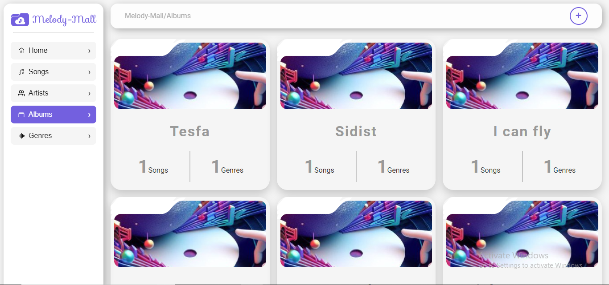

# Song store frontend


## [See how it looks live](https://song-store-frontend.vercel.app/)

Also checkout  
[The backend repository](https://github.com/fikireab-m/song-store-backend) 
Or   
[Backend on render](https://addiss-software-test.onrender.com)

Tech stacks

- [**React**](https://react.dev/)
- [**TypeScript**](https://www.typescriptlang.org/)
- [**Redux** ](https://redux.js.org/)
- [**Redux-saga**](https://redux-saga.js.org/)
- [**@motion/stayled** ](https://emotion.sh/docs/styled)
- [**Vite**](https://vitejs.dev/)

## Getting started

- Clone or fork this repository. If you wish to clone, you can use

```
git clone https://github.com/fikireab-m/song-store-frontend.git
```

- Install the dependencies

```
npm i
```

- You are ready, fire up the app using

```
npm run dev
```

### How it looks




### Mobile view


